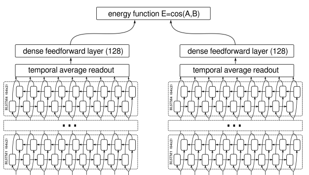
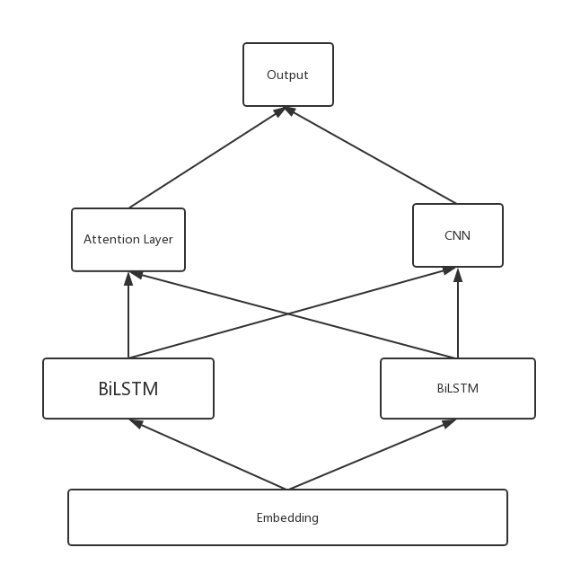
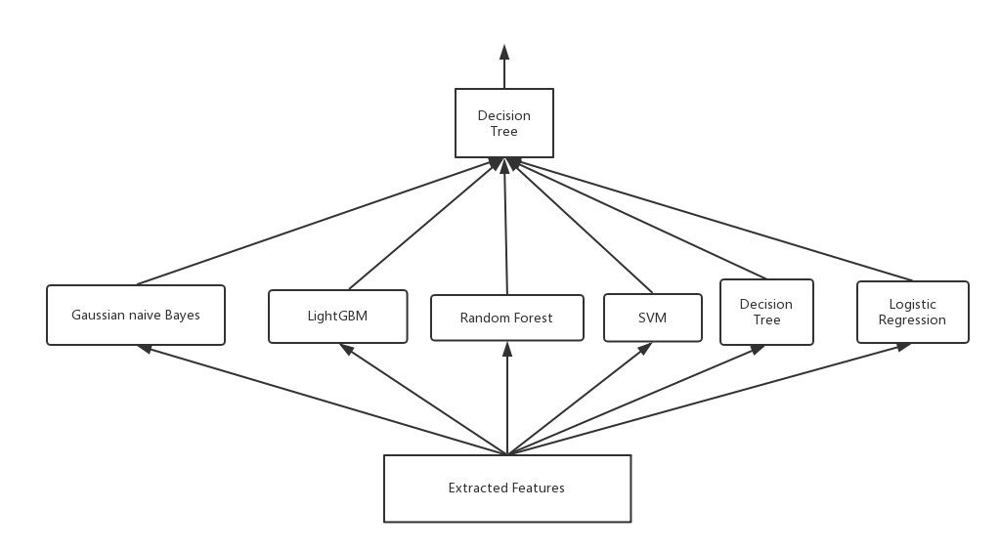

## Report for SummerCamp_in_ZJU 

#### Outline

> 1. Abstract
> 2. Algorithm Procedure
> 3. Preprocessing
> 4. Feature Extract
>    + Shallow Semantic Feature
>    + Deep Mining Feature
> 5. Ensemable Classifier
> 6. How to Run the Project


### Abstract 


In the shortly one month practice, I start to be in the field of NLP, which is short for natural language process.  And the main work is surrounded to the Chinese semantic similarity detection.  The work could be divided into three part: 1) Learn from  the papers and blogs,  I get the generally understanding  of this field, including the traditional methods and the original ML ways. 2) I make an implemention for the solution in the Chinese semantic similarity, which involves the data preprocessing, extraction of feature and the final predict.  It is worth mentioning that I make the combination of many novel methods into my algorithm procedure, involves some deep learning techniques, and the ensemable learning. 3) To demonstrate my algorithm's efficiency,   the experiment was been made on the real-world dataset, and get the high accuary of 84 percent.  I believe the experience in the one month practice could make a contribution on my further learning and research. 


###Algorithm Procedure


The algorithm could be divided roughly into three parts, preprocessing, feature extraction and the final prediction. And the whole algorithm procedure flow chart is shown as the following figure shown.


And the details will be discussed in the following chapters.


### Data Preprocessing


The data in the real-world dataset, is in the form of  "order/sentence 1/sentence 2/label". And there also has many things for us to deal with. Firstly, to  transform the word into vectors, we should split the sentence into words. And in this part, I use the ready-m ade solution which called "jieba" to do the Chinese word segmentation. But there also exists some problem in this step. For example, there exists some words that has not been included in the dictionary, and there also could find that some spell mistakes in the raw data. Hence I import the external data, like extra dictionary and the word correction table to solve the two problems. 

And  the second part is the word embedding. To guarantee the efficiency of the embedding, I import the external pre-trained word embedding with 300 dimensionalties, which includes the original data from Baidu Encyclopedia,  Wikipedia_zh, People's Daily News, Complete Library in Four Sections, etc. And to promise the embedding includes any words appeared in my training data, I use the training data as the input, to train another word embedding, which could be seen as a substitution of original dictionary. And the experiment has prove that, approximately one in ten of words are using the substituted dictionary in the word embedding.

And inspired by one paper, I consider not only the word feature, but also the character feature. Hence, in the data preprocessing status, the two kind of embedding are both  offered  to the feature extraction stage. 


### Feature extraction


The feature extraction involves two parts. The one is the semantic feature, and the rest is the deep learning feature. They will be discussed seperately.

#### Shallow Semantic Feature

The semantic feature is not the main point of my work, but it also is worth to say. The information that extracted by manual is always useful for the final prediction. And for the specific dataset, I provide three angles to measure it. 

- The statistical characteristic, such like the length of the sentence, the ratio of modal particle.
- The external knowledge, such like whether key words exist.
- The similarity of the composed words, such like the sum of the word vectors. 

And in this dataset, I extracted 7 features for semantic feature.

> + The length of the sentence.
> + The ratio of modal particle.
> + Whether key words exist.
> + The sum of the word vectors.
> + whether exists the same words
> + The difference in the word of the two sentences.
> + The 3-gram features: N-gram is an algorithm based on statistical language model, also known as first-order markov chain.The basic idea is to move the contents of the text to a sliding window of size N in bytes, forming a sequence of fragments of length N.Each byte fragment is called gram, and the occurrence frequency of all gram is counted and filtered according to the preset threshold to form the key gram list, which is the vector characteristic space of this text.Each gram in the list is an eigenvector dimension. 

And the model which only includes the semantic features could not get a good performance, however, the model which involves these features could make an obvious improvement. 

#### Deep Mining Feature

The deep mining feature could be gotten by training of the neural network, and the main network structure are reference to the siamese biLSTM network[3],  and it could be approximately represented by the following figure.



And to extract the gobal feature more sufficient, I change the structure of the original network. And add the CNN layer, which based on the siamese BiLSTM networks. And the changing network stucture would be given by the following figure.




(Many details are ignored in the graph, such as the Dropout layer and Pooling, just pay attention to the attention layer and the CNN, and the attention layer could be the seq2seq as the self-attention, which refer to the [2])

And this network could be utilized to extract the words' and characters' deep features seperately. 

### Ensemble Classifier

In the last part, I use the ensemble learning method to improve the model's fitting capacity. The flow chart for the structure of ensemble classifier is  shown as follows.



And the  ensemble model could perform better than the single model. Besides, to overcome the overfitting phenomenon, I add some restriction around the strong submodels, such like the SVM, which is short for support vector machine, that the maximum iteration times can not exceed 200 times. 


### How to Run the Project

After you download the project and the dataset,you could run the project in the following steps.

Firstly, you should change the root address of the project. In the util.py, you will find the next code:

```python
# choose the acer PC to run the project
 project = Project.init('I:/AI and DataStructure/Chinese WordEmbedding/SummerNLP',create_dir=False)

# choose the linux server to run this project
project = Project.init('', create_dir=False)
```

You could change the address which suit yourself.

And then run the code in the following order:

```python
python util.py
python Preprocessing.py
python Semantic_feature_extract.py
python DL_feature_extract.py
python main.py
```


#### Reference

1. **Learning Text Similarity with Siamese Recurrent Networks** ,

Paul Neculoiu, Maarten Versteegh and Mihai Rotaru Textkernel B.V. Amsterdam    

2. **A COMPARE-AGGREGATE MODEL FOR MATCHING TEXT SEQUENCES **,

Shuohang Wang, School of Information Systems Singapore Management University    

3. **Attention Is All You Need** 

Ashish Vaswani∗ Google Brain avaswani@google.com     

4. **Analogical Reasoning on Chinese Morphological and Semantic Relations**

Shen Li,Zhe Zhao, Renfen Hu, etc.

5. **Siamese Recurrent Architectures for Learning Sentence Similarity **

Jonas Mueller Computer Science & Artificial Intelligence Laboratory Massachusetts Institute of Technology    